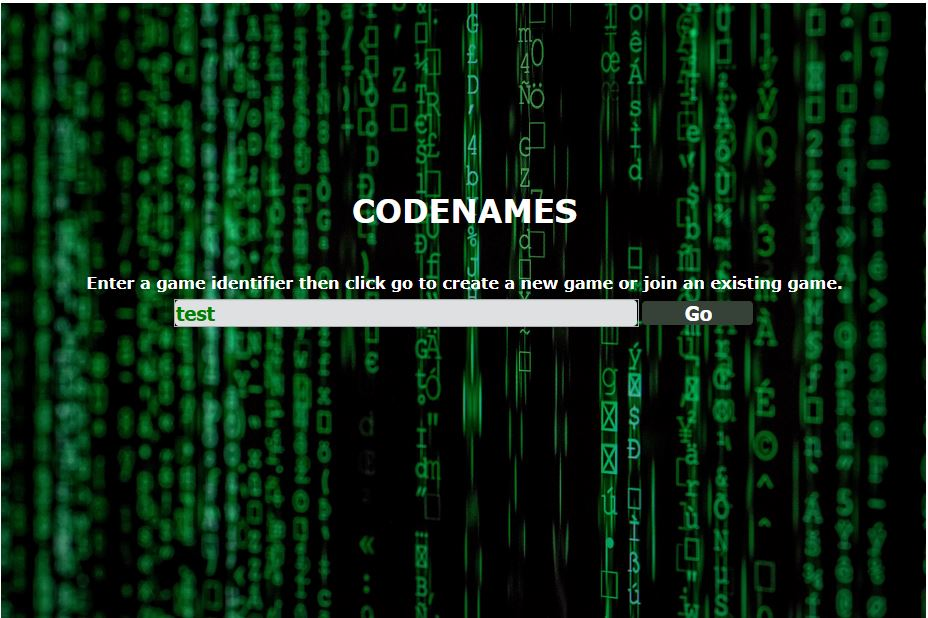
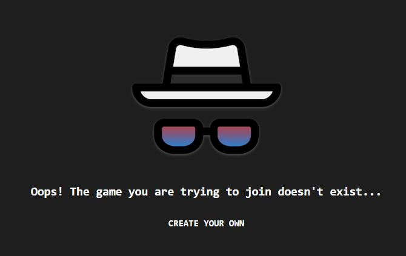
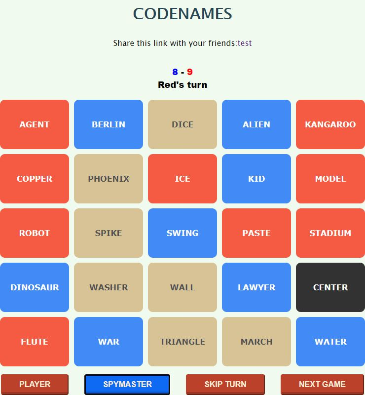
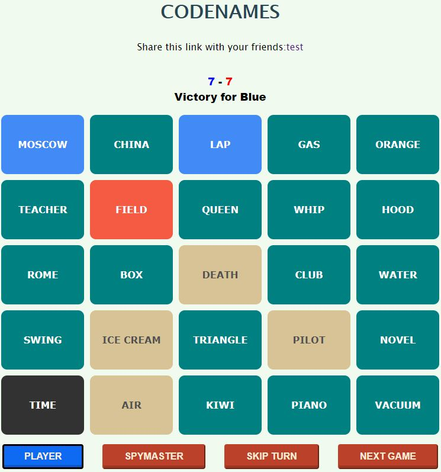
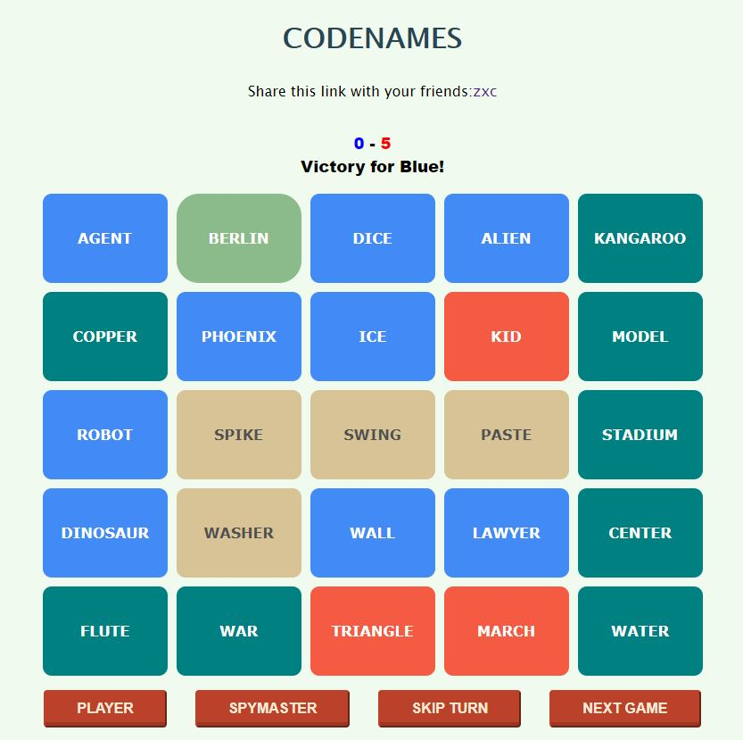

#Codenames

## Contributors

Made with [contributors-img](https://contrib.rocks).

## About the Project
### Screenshots

(A) Home           |  (B) ID not found
:-------------------------:|:-------------------------:
   |   

(C) Spymaster view           |  (D) Assassin clicked
:-------------------------:|:-------------------------:
   |   

(E) All cards found            |
:-------------------------:|
  |

### Brief Overview

Codenames was originally a board game made in 2015. This repository is a web-based version of that game. It is recommended that at least 4 players play. The players are split into two teams. Each team has a number of words they have to claim. The spymaster acts as an operative to give teams clues as to what their words may be. First team to claim all their words wins. There is also one wildcard (assassin), the team that selects the wildcard loses. 
[Find out more about how to play codenames here.](https://czechgames.com/files/rules/codenames-rules-en.pdf)

### Built With

* [Golang](https://go.dev/)
* [TypeScript/JavaScript](https://www.typescriptlang.org/)
* [HTML](https://developer.mozilla.org/en-US/docs/Web/HTML)
* [CSS](https://developer.mozilla.org/en-US/docs/Web/CSS)
* [RedisDB](https://redis.io/)

### My Contribution

In terms of coding, I was involved in the UX/UI, general front-end logic, and quality assurance. I designed and implemented the overall design and layout of the application, implemented the game's logic, and tested the application for bugs.
